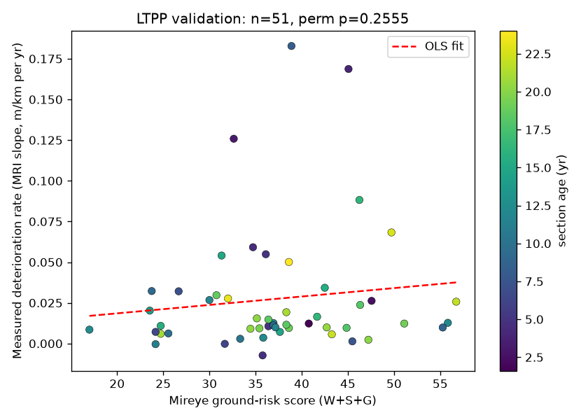

# Subgrade

**Cited road-deterioration risk for local road networks, built on Mireye.**

Subgrade takes a county's road network and returns a ranked, per-segment forecast of *which roads
will deteriorate fastest and why* — with every input traceable to a federal source. It is the
**cause layer** for pavement management: not "which roads are rough today" (increasingly
commoditized by connected-vehicle sensing) but "which roads sit on ground conditions that make them
fail early."

> Status: working end-to-end prototype on the Leesburg + Ashburn corridor of Loudoun County, VA.
> Built as a Mireye take-home over 8 disciplined sessions (see `WORKLOG.md`); every model mistake
> caught along the way is logged in `ERRORS.md`.

---

## 1. The problem and who it's for

America has far more failing road-miles than budget. The 2025 ASCE Report Card grades roads **D+**
with a **$684B** ten-year gap. Timing dominates the economics: a dollar of preventive maintenance
saves **$4–$10** of later rehabilitation. So the decision that matters is *which segments to treat
next* — and that requires **predicting** deterioration, not just measuring it.

The deployed prediction models are deterministic and omit the localized factors that provably drive
failure: **subsurface soil, drainage, and climate**. Moisture is the single most important predictor
of pavement structure; expansive soils add 20–30% to rehab cost. Yet **no agency assembles the cause
data** — joining USDA soil, USGS water, FEMA flood, and NOAA climate to road segments — and the
local roads that make up most US road-miles are still rated by windshield survey.

**Primary user:** county and city public-works directors and engineers — the owners of most US
road-miles — who today prioritize repaving by visual ratings and complaints. Their mandate
(risk-based asset management) is real; their cause data is not.

## 2. Why Mireye (vs the alternatives)

- **vs Google Maps** — Google has *zero* subsurface, soil, drainage, or hazard data. It does not
  know what is under the road.
- **vs a GIS analyst** — reproducing one county's inputs means stitching SSURGO, FEMA NFHL, NOAA
  normals, NWI, and USGS terrain rasters: days of work per county, versus **one API call per point**.
  Mireye is the assembly step, productized.
- **vs a generic LLM** — an LLM will confidently invent a soil type and cite nothing. A county
  engineer defending a budget to a board needs *"USDA says poorly-drained silty clay,"* with a
  **source URL and fetch date**. Mireye's provenance tagging is the load-bearing feature here — it is
  why every why-card line in this build carries a federal source link, and why the copilot refuses
  what its tools can't source.
- **Mireye-native differentiator: confidence propagation.** Mireye caps confidence on gap-filled
  soil (STATSGO vs SSURGO); Subgrade carries that through, so every segment score has an A/B/C
  confidence grade. The output is honest by construction — in Loudoun that means **no A grades**,
  because the soil is reconnaissance-scale everywhere.

## 3. How to run it

Requires Python 3.11 and `mdbtools` (`brew install mdbtools`, for the LTPP Access databases).
Put a Mireye token in `.env` as `MIREYE_TOKEN=...` (and `ANTHROPIC_API_KEY=...` for the copilot).

```bash
uv venv --python 3.11 .venv && uv pip install -r <(echo "geopandas shapely pyproj pandas pyarrow httpx folium streamlit streamlit-folium anthropic matplotlib arcgis")
.venv/bin/python src/network.py      # build the road network + AADT join  -> data/segments.parquet, points.parquet
.venv/bin/python src/fetch.py        # cache-backed Mireye fetch (resumable) -> provenance store + audit.json
.venv/bin/python src/score.py        # scoring engine + Folium map          -> data/scores.parquet, output/map.html
.venv/bin/streamlit run src/app.py   # the one-page app: map + cited why-card + county copilot
```

Validation (optional): `.venv/bin/python src/validate.py` runs the LTPP test and writes
`output/ltpp_validation.png`.

## 4. What worked

- **End-to-end, at scale, cached.** A cache-backed, resumable fetch loop pulls Mireye's ground +
  climate fields for the corridor, storing every value with full provenance (`value, source,
  source_url, fetched_at, confidence`). Re-runs never re-spend the rate limit.
- **A ranked map a county engineer could act on** — `output/map.html`, segments colored by risk,
  grade in the tooltip — plus **cited why-cards** where *every factual line traces to a provenance
  row* (no provenance row, no sentence).
- **A county copilot** wired to two tools (the scored dataset + live Mireye) that answers "why is
  this segment ranked first?" and **refuses** "which segment will fail in March 2027?" — because the
  data cannot answer it. (Transcripts in `WALKTHROUGH.md`.)
- **Empirical validation against federal ground truth (LTPP).**



  For 51 LTPP pavement sections (Virginia + climate-adjacent states), we compared each section's
  *measured* deterioration rate (roughness slope over time, within one construction cycle) to
  Subgrade's ground-risk score, **controlling for age and traffic**. Top-quartile ground-risk
  sections deteriorated **~17% faster** (median 0.0127 vs 0.0109 m/km/yr) — the right direction — but
  the effect is **not statistically significant** (permutation *p* = 0.26, n = 51). A shuffled-label
  permutation test confirms **no pipeline leakage** (shuffled coefficient ≈ 0). We did **not** tune
  thresholds to manufacture significance. Why the signal is weak is itself the finding: LTPP sections
  are Interstate/arterial roads with *engineered, often soil-stabilized* subgrades — little native
  ground variation — while Subgrade's signal is strongest on the **local roads LTPP barely samples.**

## 5. Where the data fell short

The full, agent-drafted report is **[`docs/shortfalls.md`](docs/shortfalls.md)** (generated from the
audit log and human-edited). The headline gaps, confirmed by this build:

- **No corridor primitive** (see §6 — the headline product feedback).
- **No precipitation field** — the climate layer has temperature/snow/solar but not rainfall, a
  top-tier deterioration driver. (Fillable from NOAA; not integrated here.)
- **No freeze-thaw cycle count** — only snow-cover days as a proxy for the cycling that cracks
  pavement.
- **SSURGO/STATSGO soil is reconnaissance-scale** — scores are screening-grade, not geotech-grade,
  and Mireye's confidence caps make that visible (no A-grade segments in Loudoun).

**Known limitations of this build** (consciously deferred; see [`FUTURE.md`](FUTURE.md)): **bridge
spans are not excluded** (PRD §5 — a robust filter needs a bridge-distance field Mireye doesn't
expose); the HPMS spot check, NOAA precip/freeze gap-fill, and truck-share uplift are not wired in.

## 6. The corridor critique (headline product feedback)

**Mireye is a point API; roads, pipes, rail, and transmission are lines.** This build simulates
corridor coverage by *spraying point queries* across the network — thousands of them — which is both
a **cost driver** (calls scale with point density, not corridor length) and a **fidelity loss**
(everything between sample points is interpolated, not measured).

The evidence is this build's own call counts (from `data/audit.json`):

> **7,870 Mireye `/v1/fetch` calls to cover 7,877 sample points** across the Leesburg + Ashburn
> corridor — essentially *one call per point* (only 7 coordinates deduped). Cost scales with point
> density, not corridor length. **0 rate-limiting** observed across the whole run; the binding
> constraint is per-call latency (2–6 s cold), not quota — which is why a full Loudoun County run was
> scoped down to this corridor. And this corridor is a fraction of one county: the point-spray
> approach does not scale to a route network without a native line primitive.

A native **polyline endpoint** — post a linestring, get sampled fields back — would open the
linear-infrastructure asset-management market and remove both the cost and the fidelity penalty. This
is the single highest-value ask for a linear-asset use case, and the build itself is the evidence.

---

*Scope, decisions, and kill-criteria per session: `WORKLOG.md`. Caught model mistakes and how they
were found: `ERRORS.md`. Demo script: `WALKTHROUGH.md`. Deferred work: `FUTURE.md`.*
